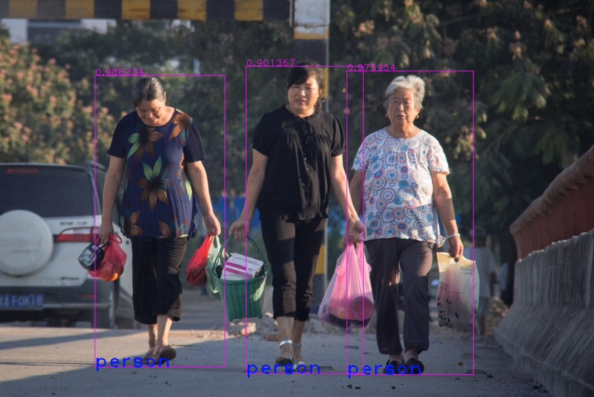

# MobileNet-SSD-TensorRT
**To accelerate mobileNet-ssd with tensorRT**

**TensorRT-Mobilenet-SSD can run 50fps on jetson tx2**

---

**Requierments:**

1.tensorRT4

2.cudnn7

3.opencv

---

**Run:**

```shell
cmake .
make
./build/bin/mobileNet
```

---

**Reference:**

https://github.com/saikumarGadde/tensorrt-ssd-easy

https://github.com/chuanqi305/MobileNet-SSD

I replaced depthwise with group_conv,because group_conv  has been optimized in cudnn7

I retrianed mobileNet-SSD,my number of classfication is 5

---

**TODO:**

- [x] To save serialized model 
- [x] To solve the bug of getting different result with same input
- [ ] The bottleneck of time cost lies in the decoding of pictures. "imread" cost too much ,to resolve it.
- [ ] To modify the architecture, decrease the time cost

**The bug has been fixed**

